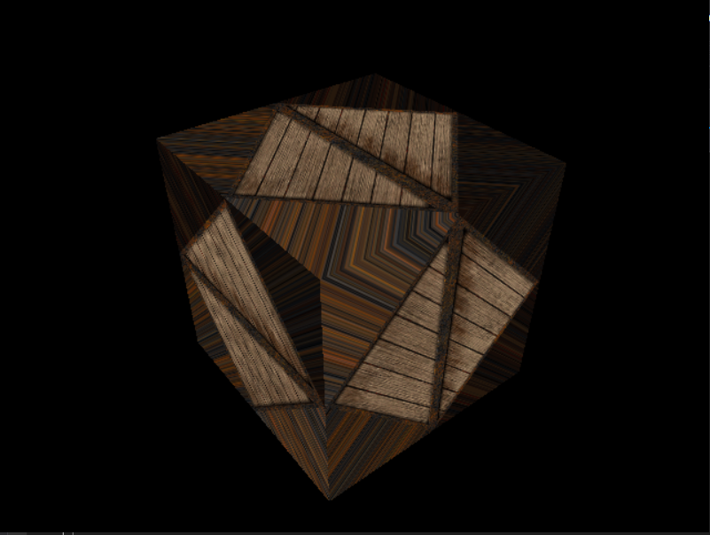

# BMSTUComputerGraphicsLabs

Результатом лабортаорной работы является куб, состоящий из треугольных полигонов. На данные полигоны наложена текстура с настройками без повторений для наглядного отображения, что текстура наложена на треугольники под углом 45 градусов без дополнительных полигонов.

# Результат работы

